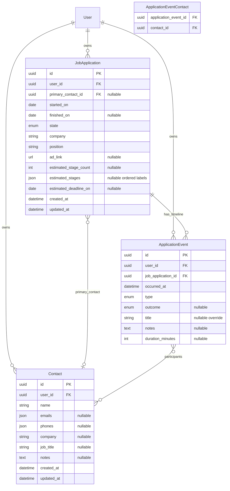

# Core Domain Model

Design reference for the job-search domain. This document describes data
structures only — no implementation yet.

See also: [Product discovery summary](discovery_summary.md).

## Overview

Three core entities drive the MVP application tracker, kanban pipeline, and
contact rolodex:

- **JobApplication** — one role at one company; holds metadata and current
  pipeline position.
- **ApplicationEvent** — a touchpoint on an application's timeline (past or
  future).
- **Contact** — a person who reaches out to or meets the candidate (recruiter,
  hiring manager, HR, etc.); names, emails, and phones.

Every row is **user-scoped** (`user_id` FK to `users`) — matching the existing
multi-tenant pattern in the backend.



---

## JobApplication

### Purpose

The kanban card / CRM record for one role at one company. Holds stable
metadata and current pipeline position; the **timeline of activity** lives in
events.

### Fields

| Field | Type | Required | Notes |
|-------|------|----------|-------|
| `id` | UUID | yes | Primary key |
| `user_id` | UUID FK | yes | Owner (`users.id`) |
| `started_on` | date | yes | When tracking began (usually apply date) |
| `state` | enum | yes | Current kanban column (see ApplicationState) |
| `finished_on` | date | null | Set when a terminal state is reached |
| `company` | string (255) | yes | Plain text for MVP; extract to `Company` later |
| `position` | string (255) | yes | Role title |
| `ad_link` | URL string | null | Job posting URL |
| `estimated_stage_count` | int (≥ 0) | null | Quick "~3 rounds" indicator |
| `estimated_stages` | ordered string list | null | Optional labels; length may differ from count |
| `estimated_deadline_on` | date | null | Expected decision / offer deadline |
| `primary_contact_id` | UUID FK | null | Main recruiter or point of contact (`contacts.id`) |
| `created_at` | timestamptz | yes | Audit |
| `updated_at` | timestamptz | yes | Audit |

#### `estimated_stages` format

Stored as a Postgres `JSONB` array of strings in display order. Example:

```json
["Recruiter screen", "Technical", "Hiring manager", "Offer"]
```

`estimated_stage_count` can differ from the array length (e.g. count = 4 but
only two stage names are known). The UI shows the count when labels are empty.

### ApplicationState enum

Fixed pipeline states for the kanban board. Stored as a Postgres enum (via
`to_sql_enum` in the backend).

| Value | Meaning | Terminal? |
|-------|---------|-----------|
| `interested` | Saved, not yet applied | no |
| `applied` | Application submitted | no |
| `screening` | Recruiter / HR initial step | no |
| `interviewing` | Active interview loop | no |
| `assessment` | Take-home, online test, case study | no |
| `offer` | Offer received, deciding | no |
| `accepted` | Offer accepted | **yes** |
| `rejected` | Explicit rejection | **yes** |
| `withdrawn` | Candidate withdrew | **yes** |
| `ghosted` | No response after reasonable follow-up | **yes** |

### Invariants

Enforce at implementation (service layer or DB constraints where practical):

- `finished_on` must be set when `state` is terminal; must be null otherwise.
- `finished_on >= started_on`.
- `estimated_deadline_on >= started_on` when set.

### Optional MVP+ fields

Not required for the first implementation pass; document here for forward
compatibility.

| Field | Type | Rationale |
|-------|------|-----------|
| `notes` | text | Free-text summary on the card without opening the timeline |
| `source` | enum | `linkedin`, `company_site`, `referral`, `recruiter`, `other` — feeds analytics |
| `location` | string | Remote / hybrid / onsite + city |
| `salary_range_text` | string | Unstructured until salary benchmarking exists |
| `priority` | enum | `low`, `normal`, `high` — kanban sorting |

---

## ApplicationEvent

Use the name **ApplicationEvent** in code and docs (not bare `Event`) to avoid
clashing with scheduler/infra "events" in `backend/src/scheduler/`.

### Purpose

One row per meaningful touchpoint on an application timeline — past or future.

### Fields

| Field | Type | Required | Notes |
|-------|------|----------|-------|
| `id` | UUID | yes | Primary key |
| `user_id` | UUID FK | yes | Denormalized for query efficiency and authorization |
| `job_application_id` | UUID FK | yes | Parent application |
| `occurred_at` | timestamptz | yes | When it happened or is scheduled |
| `type` | enum | yes | See EventType |
| `outcome` | enum | null | Scheduled vs completed distinction |
| `title` | string (255) | null | Override display label (e.g. "System design with Jane") |
| `notes` | text | null | Interview notes, prep, outcomes |
| `duration_minutes` | int | null | Useful for calls and meetings |
| `created_at` | timestamptz | yes | Audit |
| `updated_at` | timestamptz | yes | Audit |

### EventType enum

| Value | Typical use |
|-------|-------------|
| `application_sent` | Submitted application |
| `application_updated` | Revised resume or cover letter |
| `recruiter_outreach` | Inbound message from recruiter |
| `phone_call` | Phone screen |
| `video_call` | Video interview |
| `interview_meeting` | In-person interview |
| `online_test_submission` | Codility, HackerRank, etc. |
| `take_home_received` | Assignment sent |
| `take_home_submitted` | Assignment returned |
| `reference_check` | References requested or provided |
| `offer_received` | Verbal or written offer |
| `offer_accepted` | |
| `offer_declined` | |
| `rejection_received` | |
| `follow_up_sent` | Candidate follow-up email |
| `note` | Generic journal entry |

Add new values via Alembic enum migration (existing pattern with
`alembic-postgresql-enum`).

### EventOutcome enum

Optional on each row.

| Value | Meaning |
|-------|---------|
| `scheduled` | Future event — powers reminders and calendar views |
| `completed` | Happened |
| `cancelled` | Cancelled by either party |
| `no_show` | Missed |

**Reminder integration (future):** rows with `outcome = scheduled` and
`occurred_at` in the future are natural inputs for the existing scheduler and
notifications stack. Not wired in the initial domain implementation.

### Participants (contacts)

Link people to an event via the **`ApplicationEventContact`** junction table
(many-to-many). One event can list multiple contacts (panel interview, recruiter
plus hiring manager); one contact can appear on many events.

| Field | Type | Notes |
|-------|------|-------|
| `application_event_id` | UUID FK | Parent event |
| `contact_id` | UUID FK | Participant |

Primary key: composite `(application_event_id, contact_id)`.

When creating an event from a calendar invite or email, match or create a
`Contact` by email address before attaching.

---

## Contact

### Purpose

User-scoped rolodex of people involved in the job search — recruiters, HR,
hiring managers, interviewers. Stores identity and reachability; links to
applications and events show *who* was involved in each step.

Contacts are **deduplicated per user** (one row per person), not per
application. The same recruiter working on three roles is one contact linked
from multiple applications and events.

### Fields

| Field | Type | Required | Notes |
|-------|------|----------|-------|
| `id` | UUID | yes | Primary key |
| `user_id` | UUID FK | yes | Owner (`users.id`) |
| `name` | string (255) | yes | Full name as entered (e.g. "Jane Smith") |
| `emails` | string list | no | Zero or more email addresses |
| `phones` | string list | no | Zero or more phone numbers (E.164 preferred at validation) |
| `company` | string (255) | null | Employer or agency (plain text until `Company` entity exists) |
| `job_title` | string (255) | null | e.g. "Technical Recruiter", "Engineering Manager" |
| `notes` | text | null | Relationship notes, how you met, preferences |
| `created_at` | timestamptz | yes | Audit |
| `updated_at` | timestamptz | yes | Audit |

#### `emails` and `phones` format

Stored as Postgres `JSONB` arrays of strings. Order is display order (primary
first). Example:

```json
{
  "emails": ["jane.smith@acme.com", "jane@recruiting-agency.com"],
  "phones": ["+14155550123", "+14155550999"]
}
```

Validate format at the API layer (email syntax, sensible phone length). Empty
arrays and null are equivalent (no values yet).

Optional later: structured entries with labels (`work`, `mobile`) — use objects
in the array instead of plain strings when needed without a schema migration.

### Invariants

- `name` must be non-empty after trim.
- At least one of `emails` or `phones` should be present when the contact is
  saved from email/phone import; manual entry may be name-only initially.
- All linked `JobApplication.primary_contact_id` and junction rows must belong
  to the same `user_id` as the contact.

### Optional MVP+ fields

| Field | Type | Rationale |
|-------|------|-----------|
| `linkedin_url` | URL string | Quick link to profile |
| `source` | enum | `inbound`, `referral`, `outbound`, `event`, `other` — how the relationship started |

### Relationships

| Link | Cardinality | Use |
|------|-------------|-----|
| `JobApplication.primary_contact_id` | many applications → one contact | Default recruiter / HR owner for the role |
| `ApplicationEventContact` | many events ↔ many contacts | Who joined a call, interview, or outreach |

---

## Conventions

### Dates vs datetimes

- **Application lifecycle** (`started_on`, `finished_on`,
  `estimated_deadline_on`): **calendar dates** — day-level tracking matches
  spreadsheet habits.
- **Events** (`occurred_at`): **timezone-aware datetime** — interviews and
  calls need time. Store UTC; display in the user's locale on the frontend.

### User scoping

All queries must filter by the authenticated user's `user_id`. The denormalized
`user_id` on `ApplicationEvent` allows authorization checks and upcoming-event
queries without joining through `JobApplication`.

### Naming

| Concept | Code name | Avoid |
|---------|-----------|-------|
| Job application record | `JobApplication` | — |
| Timeline touchpoint | `ApplicationEvent` | `Event` (conflicts with scheduler) |
| Person in the job search | `Contact` | `Person`, `User` (reserved for auth) |
| Event ↔ contact link | `ApplicationEventContact` | — |
| Pipeline column | `ApplicationState` | — |

---

## Kanban and timeline behavior

**State vs events:**

- `state` is the **current kanban position** — user-editable, drives the board.
- Events are the **audit trail** — what happened and when.

The timeline is the source of truth for history. Kanban `state` answers "where
am I now?"; events answer "what happened?". This split enables future analytics
(response rate, time-in-stage) from event data alone.

Implementation may **suggest** state changes when a relevant event is added
(e.g. `offer_received` → suggest `offer`), but must not auto-overwrite
`state` without user action — avoids fighting the board when reality and
labels diverge.

---

## Indexing strategy

For implementers when adding migrations:

| Index | Purpose |
|-------|---------|
| `(user_id, state)` | Kanban board query |
| `(job_application_id, occurred_at)` | Application timeline |
| `(user_id, occurred_at)` WHERE `outcome = 'scheduled'` | Upcoming reminders view |
| `(user_id, name)` | Contact list search / sort |
| `(application_event_id)` on `application_event_contacts` | Event participants |
| `(contact_id)` on `application_event_contacts` | Contact activity history |

---

## API shape preview

No implementation yet. Follow existing project conventions:

| Layer | Location |
|-------|----------|
| SQLModel tables | `backend/src/apps/applications/models.py` |
| Pydantic DTOs | `backend/src/apps/applications/routes.py` |
| TypeScript types | `frontend/src/applications/types.ts` |
| Per-app error codes | `backend/src/apps/applications/api_errors.py` |

Contacts can live in the same app module (`Contact`, `ApplicationEventContact`
in `models.py`) or a dedicated `apps/contacts/` package if the surface grows.

Suggested endpoints (illustrative):

- `GET /applications` — list with optional embedded recent events
- `GET /applications/{id}` — detail with full timeline and linked contacts
- `POST /applications`, `PATCH /applications/{id}` — CRUD
- `POST /applications/{id}/events`, `PATCH /events/{id}` — timeline CRUD
- `GET /contacts`, `POST /contacts`, `PATCH /contacts/{id}` — contact rolodex
- `PUT /events/{id}/contacts` — replace participant list for an event

Register models in `backend/alembic/env.py` before autogenerating migrations.

---

## Future extensions

| Entity | Relationship | Notes |
|--------|--------------|-------|
| `Company` | One company, many applications and contacts | Normalize `company` string on both |
| `Attachment` | Resume version, take-home PDF | Linked to application or event |
| `Reminder` | Follow-up nudges | Or derive from `scheduled` events + scheduler |

**Email parsing / automatic interview detection** (killer features in
discovery): inbound parsers match sender address to `Contact.emails`, create
contacts when unknown, attach via `ApplicationEventContact`, and create or
update `ApplicationEvent` rows. Hook points are contact lookup-by-email and
event creation.

**Contact merge (future):** when duplicates are detected (same email, different
names), offer merge UI; implementation rewrites FKs and junction rows.

---

## Implementation checklist

When moving from design to code:

1. Add `JobApplication`, `ApplicationEvent`, `Contact`, and
   `ApplicationEventContact` SQLModel classes with enums.
2. Register models in `alembic/env.py`; autogenerate and review migration.
3. Add API routes, DTOs, and `api_errors.py` under `apps/applications/`.
4. Mirror types in `frontend/src/applications/types.ts` (and contacts types).
5. Add integration tests (real Postgres, existing test harness).
6. Replace demo `items` UI with kanban board, timeline, and contact views.

Out of scope for the design phase: scheduler wiring, `Company` normalization,
contact merge, email parsing, analytics.
